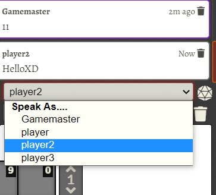

# Translate 5e Entries

利用5etools中文站內容，自動把5e角色卡內容 翻譯成正體中文

## Behavior

- 當你打開角色卡，本插件會搜尋與5eTools相關的項目(專長，魔法，工具等)，並自動取代描述內容成正體中文。
  - 這種取代方式並不會實際上修改角色卡數據，取消啓動本Modules後，一切還原。
  - 主要對像是使用5eTools Plutonium進行開咭的使用者。  

## Current Problem

- 有些內容並未使用FVTT格式，如[@DICE 1d6]。
- 一些內容可以擲骰時顯示成中文，但一些不可以。
- 所有內容是自動取代，沒有驗證。

## Changelog

### v1.0.0

Done.

## 致謝

- 翻譯內容來源自 [5eTools/中文站](https://github.com/fvtt-cn/5etools) 並使用Convertzz 進行翻譯，感謝所有相關成員。
